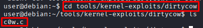

# Kernel Exploit

**Date:** June 2026<br>
**Author:** ShahinSecLab<br>
**Category:** Privilege Escalation<br>
**Difficulty:** Medium<br>
**Tools:** arp-scan, SSH, gcc, Dirty COW exploit (CVE-2016-5195)

## Table of Contents

- [Introduction](#introduction)
- [Why This Attack Works](#why-this-attack-works)
- [Lab Setup](#lab-setup)
- [What I Needed Before Starting](#what-i-needed-before-starting)
- [What I Understood During the Process](#what-i-understood-during-the-process)
- [Attack Flow](#attack-flow)
- [Step 1 — Discovering the Target and Connecting via SSH](#step-1--discovering-the-target-and-connecting-via-ssh)
- [Step 2 — Finding the Dirty COW Exploit on the Target](#step-2--finding-the-dirty-cow-exploit-on-the-target)
- [Step 3 — Compiling and Running the Exploit](#step-3--compiling-and-running-the-exploit)
- [Step 4 — Getting Root Access](#step-4--getting-root-access)
- [How Defenders Can Catch This](#how-defenders-can-catch-this)
- [How to Prevent It](#how-to-prevent-it)
- [What I Achieved](#what-i-achieved)

## Introduction
Dirty COW (CVE-2016-5195) is a Linux kernel privilege escalation vulnerability. It abuses a race condition in how the kernel handles the copy-on-write (COW) mechanism in memory. By winning this race condition, a low privilege user can write to files that should be read-only — including system binaries like /usr/bin/passwd — and use that to get a root shell directly.

## Why This Attack Works

Normally a regular user cannot write to protected system files even if they can read them. Dirty COW exploits a bug in how the Linux kernel handles private read-only memory mappings during the copy-on-write process. By triggering repeated memory writes in a tight race condition, the kernel ends up writing to the actual file on disk instead of just a private copy in memory — completely bypassing file permission checks.
This bug affected almost every Linux kernel version from 2007 up until it was patched in October 2016, making it one of the most widely impactful privilege escalation bugs ever found.

## Lab Setup
```
| Component        | Details                                  |
|------------------|------------------------------------------|
| Attacker Machine | Kali Linux                               |
| Victim Machine   | Debian Linux (Kernel 2.6.32)             |
| Victim IP        | 192.168.5.133                            |
| Access Method    | SSH with valid low-privilege credentials |
| Network          | VMware Host-Only Network                 |
```

## What I Needed Before Starting
```
| What                                   | Why                                |
|----------------------------------------|------------------------------------|
| SSH credentials for a low-privilege user | Starting point for the attack    |
| `gcc` installed on the target          | To compile the exploit code        |
| Dirty COW exploit source code (`cow.c`) | The actual exploit                |
| A target with a vulnerable kernel version | Required for the exploit to work|
```

## What I Understood During the Process

While working through this attack I realized that:

- Dirty COW is a kernel level bug — it does not depend on misconfigured files or weak permissions
- It affects the kernel itself, so almost any unpatched Linux system from that era is vulnerable
- The exploit needs to be compiled directly on the target machine since it depends on kernel behavior
- The exploit I used overwrote /usr/bin/passwd directly and dropped me into a root shell — no extra steps needed afterward
- This is a clear example of why kernel patching matters just as much as fixing application level misconfigurations
 
## Attack Flow
```
Scanned the network with arp-scan to find the target
                        ↓
Found target at 192.168.5.133
                        ↓
Connected via SSH using older RSA key exchange flags
                        ↓
Logged in as a normal low privilege user
                        ↓
Checked kernel version — 2.6.32, an old vulnerable kernel
                        ↓
Found Dirty COW exploit (c0w.c) already on the machine
                        ↓
Compiled the exploit with gcc
                        ↓
Ran the exploit — it backed up and overwrote /usr/bin/passwd
                        ↓
Exploit dropped directly into a root shell
                        ↓
                whoami → root
```
## Step 1 — Discovering the Target and Connecting via SSH

### Scanned the Network to Find the Target

I began by scanning the local network to identify active hosts.

```bash
netdiscover -i eth0 -r 192.168.5.0/24
```
`-i eth0` : Network interface to scan from
`-r 192.168.5.0/24` : IP range to scan

**Output:**
```
Currently scanning: Finished!   |   Screen View: Unique Hosts                                                    
                                                                                                                  
5 Captured ARP Req/Rep packets, from 4 hosts.   Total size: 300                                                  
_____________________________________________________________________________
   IP            At MAC Address     Count     Len  MAC Vendor / Hostname      
-----------------------------------------------------------------------------
192.168.5.2     00:50:56:f7:77:5e      2     120  VMware, Inc.                                                   
192.168.5.1     00:50:56:c0:00:08      1      60  VMware, Inc.                                                   
192.168.5.133   00:0c:29:5b:1e:66      1      60  VMware, Inc.                                                   
192.168.5.254   00:50:56:f4:f2:eb      1      60  VMware, Inc.  
```
The host at `192.168.5.133` matched the target machine used in this lab, so I used that IP address for the next steps.

<p align="center">
  
</p>

### Connected to the Target via SSH

Since the target was running an older SSH setup, I had to add extra flags to allow older key exchange algorithms:

```bash
ssh -o HostKeyAlgorithms=+ssh-rsa -o PubkeyAcceptedAlgorithms=+ssh-rsa user@192.168.5.133
```
`-o HostKeyAlgorithms=+ssh-rsa` : Allows older RSA host key algorithm — needed for older Linux systems
`-o PubkeyAcceptedAlgorithms=+ssh-rsa` : Allows older RSA public key algorithm for authentication
`192.168.5.133` : Target IP
`user`: User Name

**Output:**

```
** WARNING: connection is not using a post-quantum key exchange algorithm.
** This session may be vulnerable to "store now, decrypt later" attacks.
** The server may need to be upgraded. See https://openssh.com/pq.html
user@192.168.5.133's password: 
Linux debian 2.6.32-5-amd64 #1 SMP Tue May 13 16:34:35 UTC 2014 x86_64

The programs included with the Debian GNU/Linux system are free software;
the exact distribution terms for each program are described in the
individual files in /usr/share/doc/*/copyright.

Debian GNU/Linux comes with ABSOLUTELY NO WARRANTY, to the extent
permitted by applicable law.
Last login: Wed Jan 14 11:06:54 2026 from 192.168.5.128
user@debian:~$ 
```
It prompted for the password right after the connection request, I typed password321, and got logged in successfully. The kernel version 2.6.32 stood out right away — well within the range vulnerable to Dirty COW.

<p align="center">
  
</p>

## Step 2 — Finding the Dirty COW Exploit on the Target

The target machine already contained the Dirty COW exploit source code (c0w.c) in the tools/kernel-exploits/dirtycow directory.

I navigated to the directory using the following command:

```bash
user@debian:~$ cd tools/kernel-exploits/dirtycow
```
Inside the directory, I found c0w.c, the Dirty COW exploit source code, ready to be compiled and executed.

<p align="center">
  
</p>

## Step 3 — Compiling and Running the Exploit